# GBS POS-CMS API - Architecture Diagram

## 1. System Architecture Overview

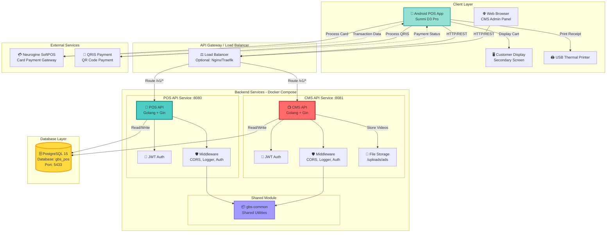

## 2. Detailed Backend Architecture

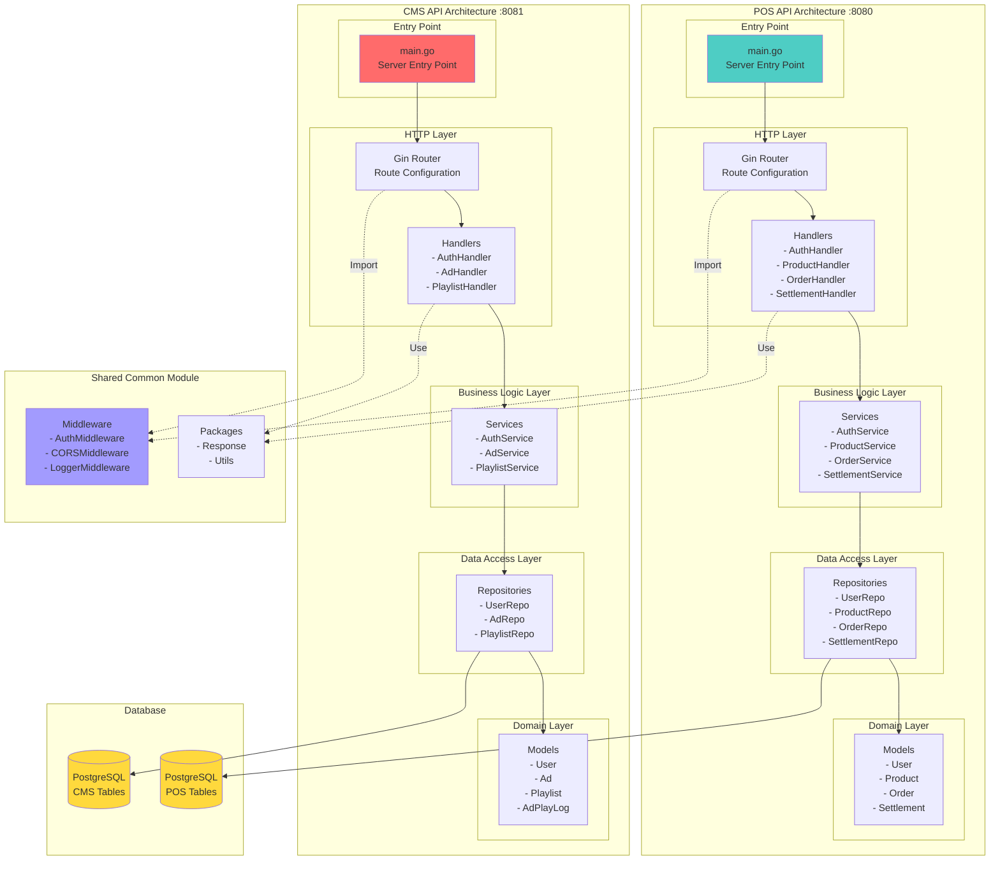

## 3. Database Schema Architecture

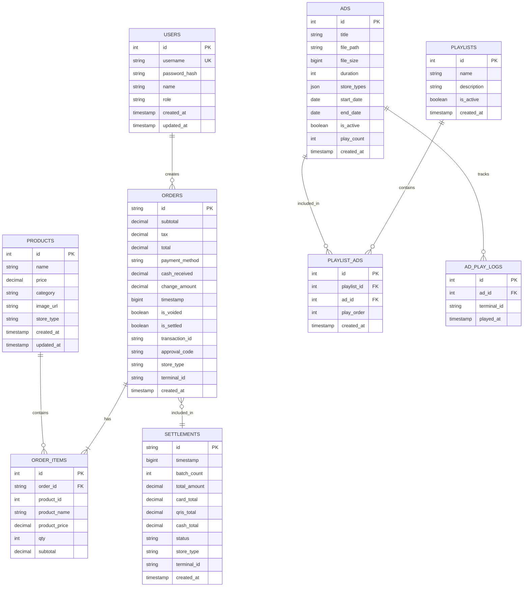

## 4. Request Flow Architecture

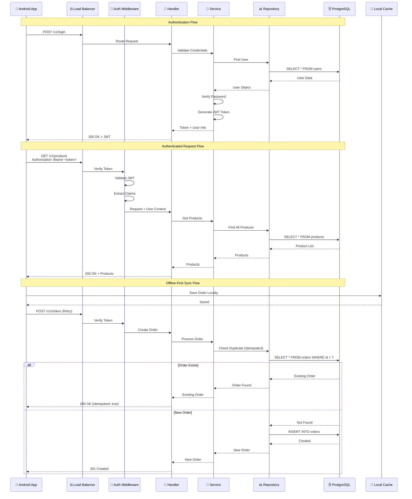

## 5. Deployment Architecture

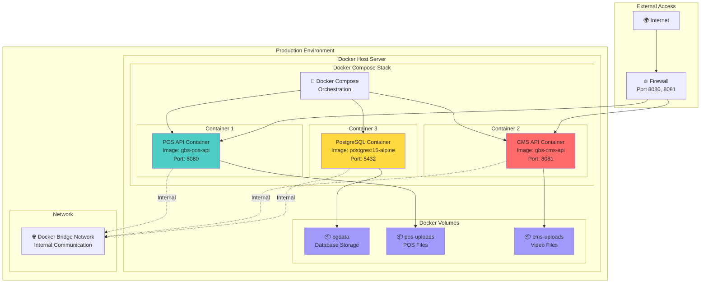

## 6. Multi-Store Architecture

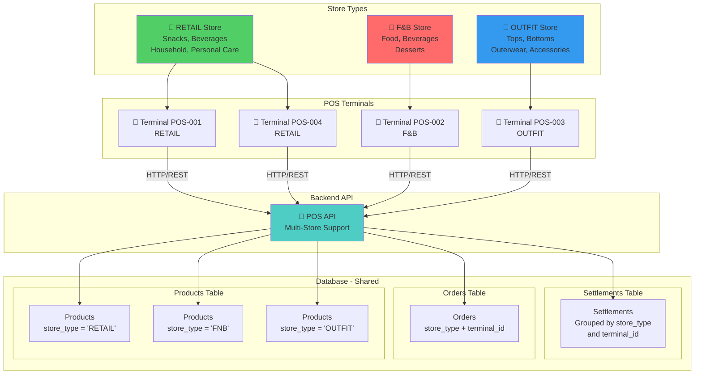

## 7. Security Architecture

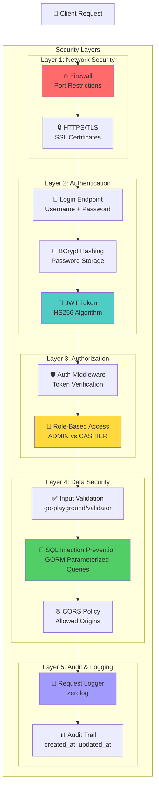

## 8. Payment Processing Architecture

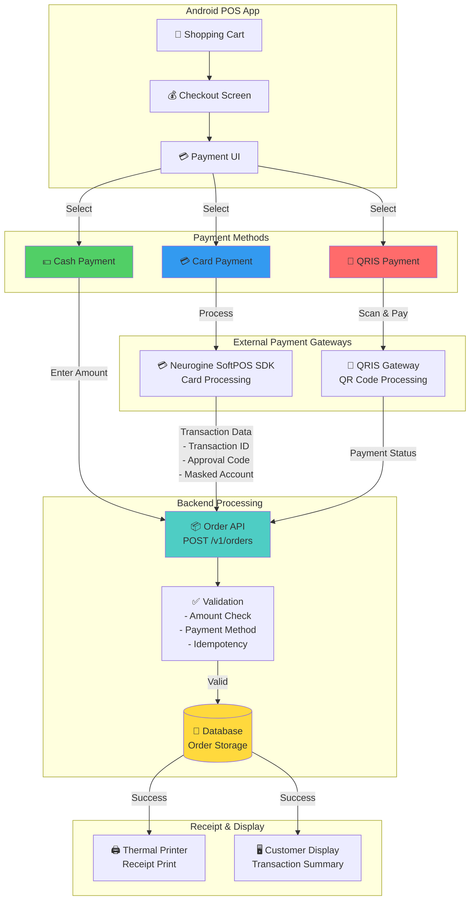

## 9. Settlement Process Architecture

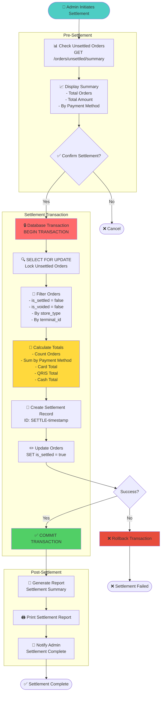

## 10. CMS Video Streaming Architecture

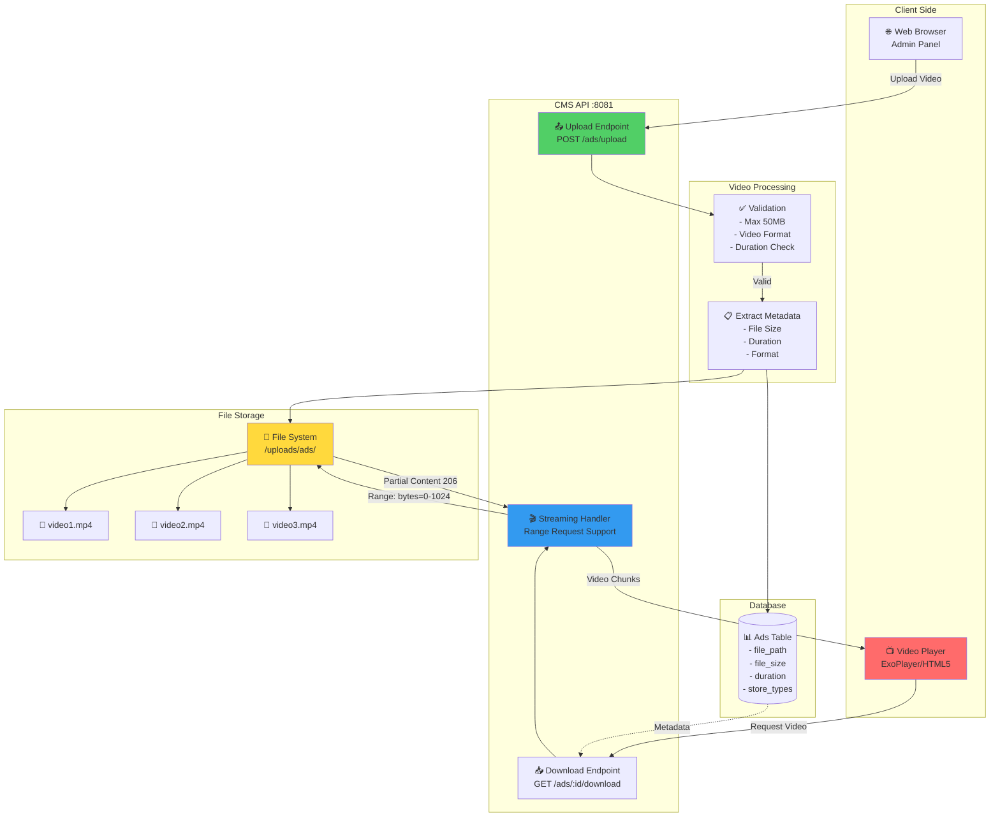

## 11. Monitoring & Logging Architecture

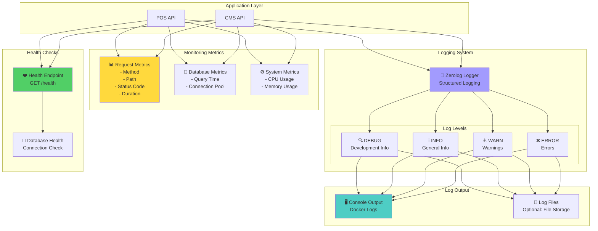

## 12. Technology Stack Overview

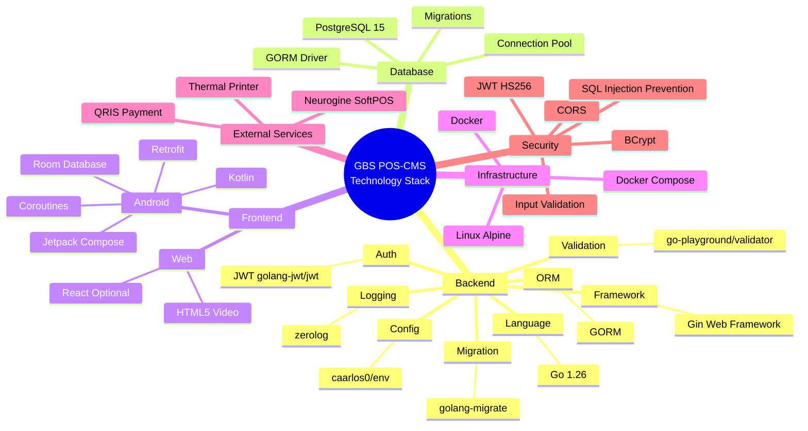

---

## Summary

Dokumentasi ini mencakup:

1. ✅ **System Architecture Overview** - Gambaran umum sistem
2. ✅ **Detailed Backend Architecture** - Arsitektur backend detail
3. ✅ **Database Schema Architecture** - Skema database ER Diagram
4. ✅ **Request Flow Architecture** - Alur request sequence diagram
5. ✅ **Deployment Architecture** - Arsitektur deployment Docker
6. ✅ **Multi-Store Architecture** - Arsitektur multi-toko
7. ✅ **Security Architecture** - Arsitektur keamanan berlapis
8. ✅ **Payment Processing Architecture** - Arsitektur pemrosesan pembayaran
9. ✅ **Settlement Process Architecture** - Proses settlement detail
10. ✅ **CMS Video Streaming Architecture** - Arsitektur streaming video
11. ✅ **Monitoring & Logging Architecture** - Arsitektur monitoring dan logging
12. ✅ **Technology Stack Overview** - Ringkasan teknologi yang digunakan

Semua diagram dapat di-render menggunakan:
- GitHub (otomatis)
- VS Code + Markdown Preview Mermaid Support
- https://mermaid.live
- Obsidian
- Notion (dengan plugin)

**Siap untuk presentasi kepada atasan!** 🎯
